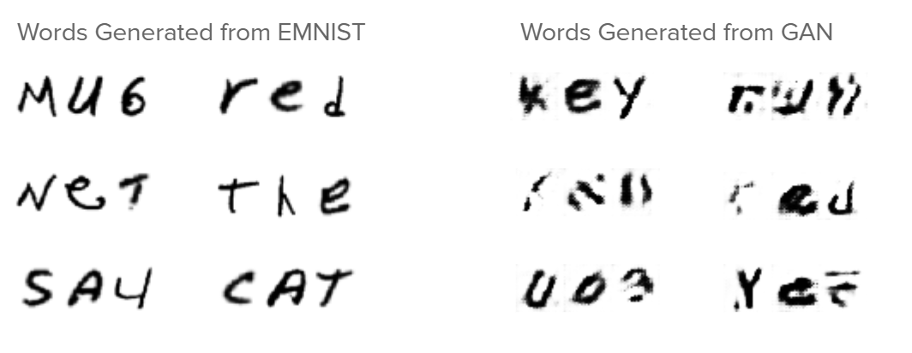

# Forgery Recognition Through Handwriting Style Extraction and Emulation

We explored the following research questions in our project:
1. How can we apply machine learning to capture stylistic elements of handwriting from images?
2. Can we utilize features learned by our models to generated stylized handwriting type?
3. How do features captured from handwritten images perform for the task of forgery identification?

Applications areas for handwriting synthesis and forgery detection models include graphic design applications, fraud detection, personal use, and criminal investigation tools.  

# Our Project

Part 1. Forgery Detection by Neural Network

Part 2. Text Generation by Generative Adversarial Network and CNN - Improved GAN

## Handwriting Synthesis

Handwriting synthesis is a recent field of study in machine learning. The problem consists of two parts: 

1. Parsing input handwritten text to extract author’s style

2. Synthesize new handwritten text based on the extracted style

Generating handwriting is not a new problem in computer science as there is a paper from 1996 that details a technique to generate handwriting without the use of machine learning [1]. This program simply spliced up input images of handwritten text into glyphs, such as the letter combination “th”, which were then strung together to create new text. Obviously this doesn’t work well for generating text that the program hasn’t seen before, and does a bad job of capturing the author’s style. Below we will explore current machine learning techniques and their individual strengths and weaknesses. 

## What features make handwriting styles unique?

The ability to extract an author’s style from handwritten text proves a difficult problem to this day. Everyone has a unique style that is made up of many different variables such as spacing between letters, whether letters are connected by ligatures, size of letters, and so on. It is important to note that these are not static features and all vary greatly between handwritten samples by the same author, so handwriting can be thought of as many distributions of independent features stacked on top of each other. Furthermore, handwriting needs to be evaluated at the character level and then the word level otherwise certain features such as ligatures will be lost. Therefore, it is very hard to identify what exactly makes a handwriting style unique, in one paper about attempting to identify authors from handwritten text researchers found their technique could not identify individual authors in a dataset of around 4,000 words but could simply groups words into classes of similar families of styles [2]. Note that depending on which language you are using and the dataset it may be possible to identify authors.

Therefore, to extract style from handwritten text there are only a few techniques available. These techniques depend on the way the handwritten text is represented as data, which in turn determines how style is represented.

## How is handwritten text represented?

There are two ways that handwritten text can be used in machine learning projects, either online or offline. Offline handwritten text are images (or pixel array values) of pictures or scans of handwritten text. This is the most abundant form of handwritten data, as a picture can be taken of any handwritten text, and therefore we can use historical documents or manuscripts with this representation. Online handwriting is the capturing of pen strokes as someone writes typically using a smart whiteboard or tablet. This ends up being a series of pen strokes, and whether or not the pen lifted off of the page with each stroke. This representation is therefore limited to handwriting that was done on these devices and therefore is relatively rare compared to offline data. 

Offline handwritten data has the benefit of using historical documents which allows someone to say extract Abraham Lincoln’s style. However, as presented below it is hard to extract features from offline data. Figure 1 is a sample of offline data from the IAM online database which shows how offline data would be processed.

**Figure 1.** [Offline handwritten data from IAM](http://www.fki.inf.unibe.ch/databases/iam-handwriting-database)

Since the data is represented as an image, it is converted to an array of pixel values, which makes it hard to extract style. It is not clear in figure 1 where the L ends and the e begins, or the e and t. Offline data also makes storing someone’s style difficult, do you store the average pixels that makeup a character and the variations for certain features, if this is the case, how do you determine which features will be relevant before processing. These issues make it hard to work with offline data.

Online handwriting data is rare to find, and since the author had to write on a tablet or whiteboard it typically is messier than their actual handwriting. Because of this, their style may not match with their actual handwriting style. However, compared to offline handwriting, online handwriting is much more meaningful for extracting unique features of handwriting, this is because it is represented as a series of pen strokes. Figure 2 shows the online handwritten text from the IAM offline database. Note that the characters should be connected as shown by the dots connecting them.

**Figure 2.** [Pen Strokes representing online handwriting](https://github.com/sjvasquez/handwriting-synthesis/pull/14#issuecomment-439935942)

With online handwritten data it is simple to tell when one letter ends and the next begins as we have the discrete points that create each letter. Since data is also included about when the pen lifts up then more complex features such as real time handwriting generation can be done. Finally, since we have the (x, y) of each pen stroke then we can determine the 'curviness' of each letter, where the ligatures connect each letter, the average distance between letters and so on.

Although this section seems like it’s leading to the conclusion that online handwritten data is better this is not necessarily the case as we will see in the following sections about each technique and what form of data it uses. Since offline handwritten data consists of historical documents it is more attractive to get a model working with it, as this can then be applied to all handwritten text ever, whereas online handwritten text requires the apparatus to record it. 

## Machine Learning with Handwriting

In this section we will explore the three general techniques we found while researching this topic and compare and contrast their strengths and weaknesses. We will discuss long short-term memory neural networks, generative adversarial networks, and dynamic programming with random forests. Each of these models uses different techniques to generate text, and we will explain how this influences the quality of generated text.

### LSTM
Long Short-term Memory (LSTM) is a Recurrent Neural Network (RNN) architecture that is designed to store and access information better than RNNs, which have a diminishing ability to model long-range structures. This problem is because the network’s predictions are based only on the last few inputs, which were themselves predicted by the network. The longer memory present in LSTMs provides an opportunity to recover from past mistakes due to the stabilising effect of a longer memory. The prediction network used by Graves, 2014 uses a deep RNN composed of stacked LSTM layers, and generates results that are competitive with state-of-the-art language models in both single glyph or word generation. A key difference of the LSTM is that due to the time step-context based learning, it is only able to learn from online writing, which consists of a sequence of strokes represented as 2D vectors relative to the end point of the previous stroke. Graves uses the IAM Online Handwriting Database to provide experimental results.

**Figure X.** Long Short-term Memory Cell used in Graves' LSTM

Graves’ LSTM uses purpose-built memory cells seen in Figure X above to store information. The prediction within the network consists of a multinomial distribution, of size equal to the number of text classes, which is parameterised by a softmax at the output. This poses a problem for most cases of prediction done on a word level since the number of text classes is equal to the number of words in the dictionary. Prediction done on a character level has been shown to have slightly worse performance than equivalent word-level models, however it has more interesting applications because the finer granularity maximizes the generative flexibility of the resulting model.

### GAN
Generative adversarial network (GAN) models are a machine learning technique that aims to automatically create the best output possible with the least effort from the programmer (Goodfellow et al., 2014). This is done by creating two neural networks that work together to automate the process of improving models. One neural network is the generator which outputs data which the other neural network, the discriminator, attempts to distinguish whether the data is computer-generated or not. The goal of the generator is to increase the error of the discimator by creating the most believable samples possible, this is done by backpropagating to each network after each classification by the discriminator.

Using a GAN to generate handwriting requires less data than other techniques which is a large benefit as other techniques take thousands of annotated samples to run (Alonso et al., 2019). The GAN we focus on here from Alonso et. al. uses the Graves’ LSTM described above to preprocess data (2019). This paper generates french and arabic letters, and is relatively complex. Before a series of characters is passed to the generator, it is encoded then preprocessed using a RNN with LSTM cells. This is then passed to the generator with random noise which creates handwritten text using a series of CNN layers. The data is then passed to the discriminator D which attempts to classify the writing as real or generated, and another discriminator R which attempts to recognize what word it is. The primary objective of the generator is create legible words so R attempts to recognize the output and compare it to the textual input. The generator uses an attention or window function which allows it shift through the encoded input and focus on one letter at a time with some focus on the letters before and after it.

The loss function for R is connectionist temporal classification (CTC) which is a loss function that compares two sequences with different sizes. For example the input may have different spacing than the output, but the output could still be correct, so CTC uses independent positioning and probability of next element to compare words which overcomes the challenges of normal loss functions. 

The loss function for D is a standard GAN loss which closely resembles cross-entropy loss as shown in figure 3. Here D(x) is the probability a discriminator thinks an output is real, E_x and E_z are the expected value over real inputs and all inputs (including noise). Finally D(G(z)) is the probability that the discriminator thinks a fake output is real.

**Figure 3.** [Minimax GAN loss](https://developers.google.com/machine-learning/gan/loss)

GANs are relatively new deep learning models with a number of interesting potential applications. This model is great at creating realistic output with minimal data to train on however. Therefore, it is great for datasets with only a few samples for an author. It also uses offline handwriting.  Below is an example of a generated word that looks quite realistic, beneath it is another output that looks very off. In general these models have varying degrees of success. This is due to the fact that GANs attempt to convert input from the latent space into the output space, therefore the ability to write a perfect j is in the latent space but the network has to find it which is quite difficult given that it receives random noise as input also. In addition to this, this GAN works at the character level, and therefore has trouble generating realistic ligatures as seen in both examples below. The 'ou' in 'bonjour' looks off, and the 'us' in 'olibrius' has some weird artifact of a ligature remaining. 

**Figure 4.** The output of the GAN for the word 'bonjour'

**Figure 5.** The output of the GAN for the word 'olibrius'

In summation, GANs are great for handwriting synthesis as they can use offline handwritten data, on top of that they fewer samples than other techniques to create authentic output. However, they have trouble creating realistic characters, as since they have to navigate the latent space they will rarely find the best character, and they have trouble generating ligatures between characters.

## Part 1. Forgery Detection
### Data Set: Handwritten Signatures
The [dataset](https://www.kaggle.com/divyanshrai/handwritten-signatures) contains Genuine and Forged signatures of 30 people. Each person has 5 Genuine signatures which they made themselves and 5 Forged signatures someone else made.

### Siamese neural network
Siamese models have been theorized to excel at signature detection since 1994. Thanks to the increasing computational power, they're getting more popular for different verification tasks such as face recognition, online signature verification etc. Siamese neural networks contains two identical convolutional neural networks with the same parameters and weights accepting two distinct images. The two subnetworks are then joined by a cost function at the top, which computes a distance metric between the highest level feature representation on each side of the network. The model then outputs a similarity score between [0,1] where 0 is no similarity and 1 is max similarity. Intuitively, a higher similarity score means that two inputs are likely from the same class, and lower scores indicate the opposite.

After training, the predicted similarity score on similar and dissimilar tuples are shown as following.

**Figure 6.** Summary table of similarity score

It predict a higher similarity between similar tuples than dissimilar tuples. Following are the images examples of similar and dissimilar tuples with highest and lowest similarity score. We can see that, for the similar tuple, the network can detect very similar signature while the reason for lowest score is also obvious. For dissimilar signature, the similarity score can be driven by different reasons such as low quality forgery or complete different images. Overall, our model is able to identify a signature as real or fake with 80% accuracy.

**Figure 7.** Example of real v.s real 

**Figure 7.** Example of real v.s fake 

## Part 2. Text Generation

### Data Set: EMNIST Letters
145,600 handwritten characters (A-Z) available as 28 x 28 pixelated images. The Python package EMNIST handles importing and letter label arrays are available to stratify the training data.  

### Simple GAN
Basic GAN model implemented based on GAN constructed for [MNIST digits](https://machinelearningmastery.com/how-to-develop-a-generative-adversarial-network-for-an-mnist-handwritten-digits-from-scratch-in-keras/). Basic GAN has two components:

Discriminator:
- 2 convolutional layers 
- Single output node (real/fake)
- Model trained to minimize binary cross entropy loss (minimize ‘fakes’) 

Generator:
- First dense layer (low resolution representation)
- Reshaping layers for increasing resolution
- Model updates when discriminator detects a fake

Word and sentence generation is performed by generating one letter at a time using the letter-specific generator and appending these to form individual words, with whitespace appended for spaces. The trained generators for 50 and 100 epochs of training are available in this repository, together with a Jupyter notebook that can be used to generate text and/or train additional letter-generation models. 

We find that neural network detection of generated images is correct 100% of the time, i.e. our generated images are easily detected.

### CNN GAN
To improve the basic GAN model we attempted to make the model produce more legible letters. The basic GAN model had high variance of output quality and therefore we wanted to reduce this. Ideally, we would have connected our siamese network and our GAN to produce words that were realistic, but since our GAN produces words at the letter level we could find no meaningful way to connect these two. We needed to develop a loss function that could tell us what letter in a word had the most weight on it being illegible and then backpropagate to that GAN, so this would have taken way too much time. Instead we developed a convolutional neural network (CNN) that was trained on the EMNIST dataset to classify letters. 

The CNN has 95% accuracy on the EMNIST dataset, and ideally could predict with high certainty what letter the GAN produced. Therefore, we connected the output of the GAN to the CNN and everytime the GAN generated a letter, the CNN would predict what letter it was, this process continued until the CNN predicted the input letter we wanted to produce. We thought this would generate high quality legible results, but found that the CNN was easily spoofed by poor quality characters. Overall, this was a large improvement over our base GAN model, but it still has varying output, as shown in the Figure XX below. You can clearly see that some of the words look great, and are high quality, but a few of the words still aren’t legible. It’s obvious in the first word on the right of Figure XX, that the three pronged lines were classified as a W even though they do not fully look like a W. 
 

**Figure XX.** Words generated by the improved GAN with CNN 
  
Furthermore, we created a function to create sentences, since before we could only generated set-length words. By breaking the sentence down into individual words we can generate each word at a time and then use a 28x28 white image to separate each word. These are all appended together to create sentences. 

The writing can be improved to look even more realistic by using a Gaussian blur and thresholding. The original EMNIST images are 256x256 and downsampled to the 28x28 we receive, since the GAN was trained on these it will always produce blurry characters,  therefore we can attempt to solve this counteracting their downsampling. As shown in Figure YY, first we blur the image using a Gaussian blur with kernel size (3, 3) and sigmaX = 0. Then we threshold the image to remove the gray splotches that remain around characters to get clean output. This does have a downside, as the original GAN output contains some pressure intensity, which can be seen in Figure YY before blurring is applied, this is a feature of real human handwriting. Alternatively, the output may remove all pressure aspects, but does appear more legible as it removes incorrect glyphs and gray splotches that damage a character’s integrity.

**Figure YY.** Sentences generated from the CNN GAN using blurring and thresholding

After generating 800 random words with both the real EMNIST data and the CNN GAN generated words we blurred them to create a fair test. Since the CNN GAN generated words contain gray splotches the Siamese model would always be able to identify the fakes by this. The blurred images were passed into the Siamese network with real labels pertaining to EMNIST words, and fake labels appeneded to CNN GAN generated words. We found that again 0% of our faked output could get by the Siamese model. However, the similarity scores of the inputs were much more revealing as to what changed. The similarity score between (real,real) was now only .625 and the similarity score between (real,fake) was .585. This margin is a large improvement over the original 1 and 0 scores as discussed in the baseline section above. These numbers indicate that the CNN GAN generates words that are much more realistic than the original baseline GAN as the similarity scores between real and fake are only .03 apart, therefore with only a few future improvements we could get fake text through this model, but for us these results show that legibility is a large part of how realistic a word looks.

## Legibility

The final results we discuss are legibility and its relationship with handwriting style. Throughout this project we kept finding projects that are either great at capturing handwriting style or great at outputting legible handwriting, but very few projects can do both. Here we present our findings about the legibility of our GANs compared to a handwriting style LSTM and found that our CNN GAN has significantly higher legibility. In this aspect we traded off learning a specific handwriting style and instead focused on legibility which is evident when over 50% of our outputs looked real as shown in Figure HH. As shown our models are significantly more legible than a style learning model, and this clearly encompasses the tradeoff between legibility and style learning. This relationship makes sense as many people write with such a unique style that it may not be legible to a computer right away without some training, whereas training a model for legibility creates one that has very few features as it spends it’s computing generating strong letters.

**Figure HH.** Legbility comparison of our two methods, and the LSTM implementation of Grave's handwriting synthesis (you can view these images yourself in our generated images and scribe folders).

## Discussion and Conclusions
Although we achieved results that are comparable to state-of-the-art models, generating handwriting that is undetectable is currently challenging to nearly impossible. A major problem of handwriting synthesis of the tradeoff of legibility and detectability, referring to the emulation of an initial handwriting style. Additionally, the consistency of synthesis means that it is easily able to discern many examples of generated writing due to obscure glyphs or hanging, random lines. Our CNN-improved GAN improves the legibility of generated words, however lacks the consistency of ligatures which is present in real handwriting and therefore would easily be identified as forgery when examined by hand using traditional handwriting forensics means. On the other hand, our GAN-generated data may be useful for cases where few samples are available. A possible future extension of our existing work could be done by applying a Siamese model as the GAN discriminator.

# References
*Guyon, I. (1996). Handwriting synthesis from handwritten glyphs. In Proceedings of the Fifth International Workshop on Frontiers of Handwriting Recognition (pp. 140-153).*

*Crettez, J. P. (1995, August). A set of handwriting families: style recognition. In Proceedings of 3rd International Conference on Document Analysis and Recognition (Vol. 1, pp. 489-494). IEEE.*

*Goodfellow, I., Pouget-Abadie, J., Mirza, M., Xu, B., Warde-Farley, D., Ozair, & Bengio, Y. (2014). Generative adversarial nets. In Advances in neural information processing systems (pp. 2672-2680).*

*Graves, Alex. "Generating sequences with recurrent neural networks." arXiv preprint arXiv:1308.0850 (2013).*

*Alonso, E., Moysset, B., & Messina, R. (2019). Adversarial Generation of Handwritten Text Images Conditioned on Sequences. arXiv preprint arXiv:1903.00277.*

*Dey S, Dutta A, Toledo JI, Ghosh SK, Lladós J, Pal U (2017) Signet: convolutional Siamese network for writer independent offline signature verification. arXiv preprint arXiv:1707.02131.*
